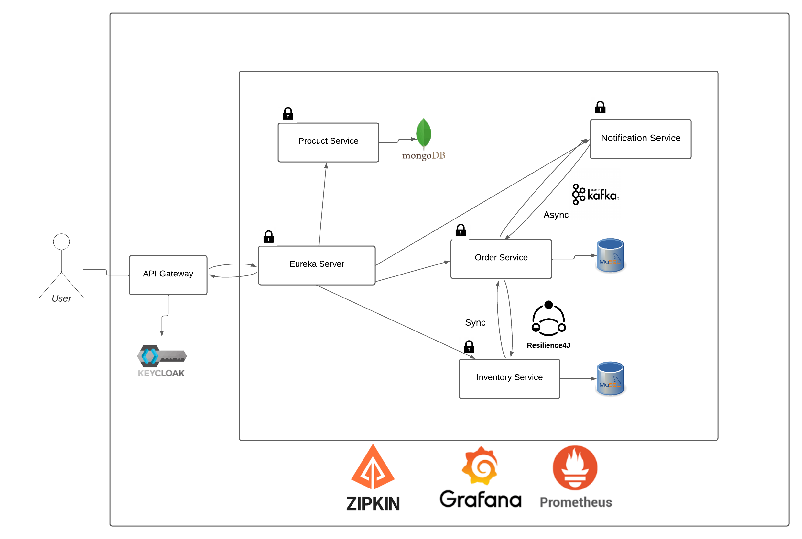
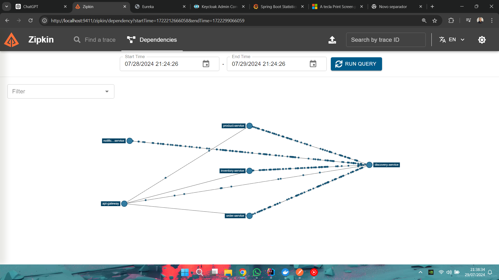
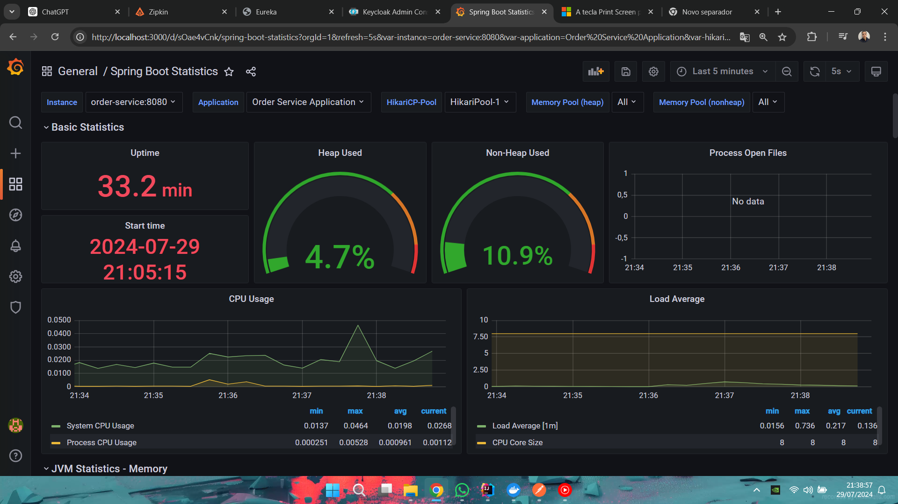
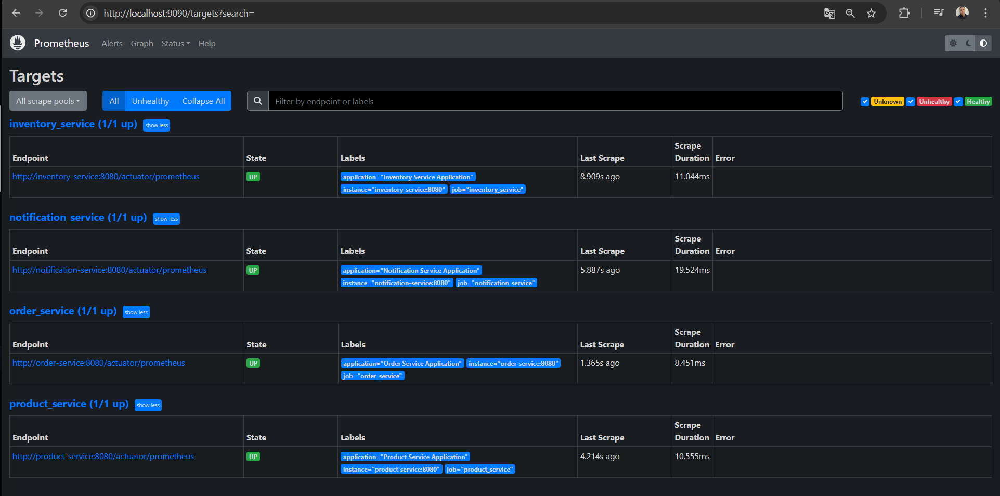
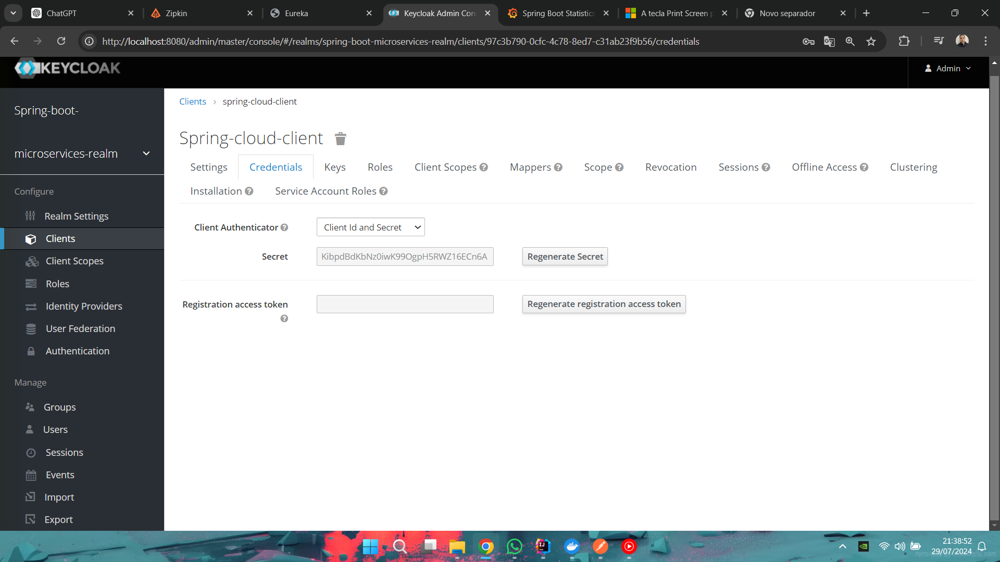
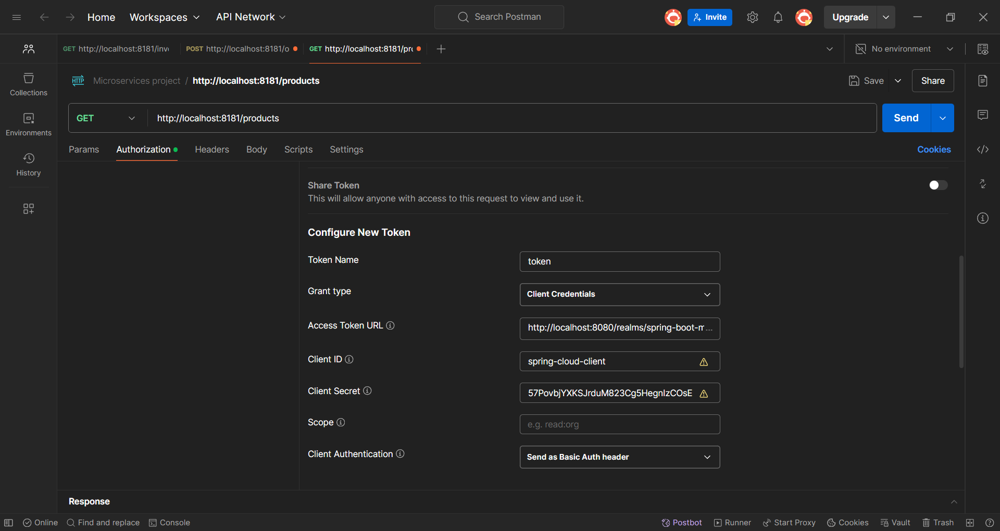
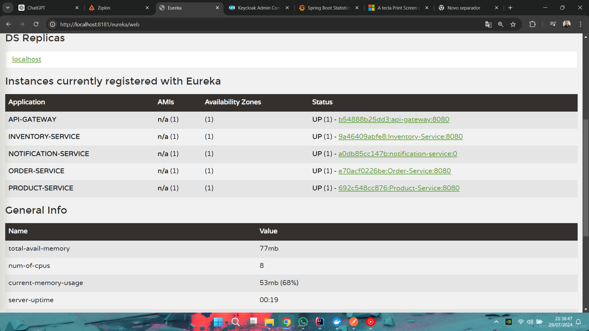

# Projeto de Microserviços Distribuídos

## Sobre o Projeto
Este projeto visa explorar e implementar uma arquitetura de microserviços usando diversas tecnologias modernas. Desenvolvido com o intuito educacional, este exemplo prático serve como um modelo para aplicativos corporativos baseados em microserviços.

## Imagem da arquitetura do projeto



## Funcionalidades
- **Cadastro e consulta de produtos:** Interação com o banco de dados através do product-service.
- **Gerenciamento de inventário:** Realiza operações de cadastro e consulta no inventory-service.
- **Processamento de pedidos:** O order-service verifica a disponibilidade dos produtos no inventory-service. Em caso de indisponibilidade, retorna uma mensagem de erro. Inclui implementações de circuit breakers e retry com resilience4j.
- **Autenticação e Autorização:** Utiliza Keycloak para gestão de autenticações e tokens.
- **Notificação Assíncrona:** Envio de eventos relacionados a pedidos através de um tópico de notificação para comunicação futura com o usuário.
## Tecnologias Utilizadas
- **Java:** Linguagem de programação para aplicativos corporativos.
- **Spring Boot:** Framework para desenvolvimento de APIs RESTful em Java.
- **Spring Data JPA / Hibernate:** Facilita a persistência de dados.
- **Spring Eureka, Spring Cloud Gateway:** Para descoberta de serviços e roteamento.
- **Grafana, Prometheus:** Ferramentas para monitoramento.
- **MySQL, MongoDB:** Sistemas de gerenciamento de banco de dados.
- **Zipkin, Kafka, Resilience4j:** Para tracing, mensageria e resiliência de serviços.
- **Docker:** Para a containerização de aplicações.
- **Maven:** Gerenciador de dependências e construção de projetos Java.
- **JUnit, Mockito, TestContainers:** Para testes unitários, mocking e testes de integração com Docker.
- **MongoExpress:** Interface web para o MongoDB.
- **Actuator:** Ferramenta para monitoramento e gerenciamento de aplicações Spring Boot.
- **Keycloak:** Para autenticação e autorização.

## Arquitetura do Sistema
Descrição geral de como os microserviços são organizados:

- **Product Service:** Gerencia informações dos produtos.
- **Inventory Service:** Responsável pelo estoque dos produtos.
- **Order Service:** Processa pedidos verificando a disponibilidade no Inventory Service.
- **Notification Service:** Envia notificações assíncronas para os usuários.
- **Discovery Service (Eureka):** Registra e descobre serviços.
- **API Gateway:** Interface única para todos os serviços, simplificando a interação do cliente com o backend.
- **Auth Service (Keycloak):** Gerencia autenticação e emissão de tokens.
- **Grafana, Prometheus, Zipkin,Actuator:** Ferramentas para monitoramento de métricas e rastreamento de logs.

## imagem da arquitetura no Zipkin



## Comunicação entre Serviços
- **Síncrona:** Os serviços utilizam chamadas HTTP REST para comunicação direta, como entre Order Service e Inventory Service.
- **Assíncrona:** Kafka é utilizado para eventos que não requerem resposta imediata, como notificações de pedidos.
## Resiliência e Escalabilidade
- Implementação de **Circuit Breaker** e Retry Patterns com **Resilience4j** para manejar falhas nos serviços.
- Uso de **Spring Eureka** para descoberta de serviços, permitindo a escalabilidade horizontal sem configuração estática de IPs ou portas.

## Monitoramento e Rastreamento com Prometheus e Grafana





## Executando o Projeto completo com Docker
Com o Docker Compose instalado e configurado, execute:
````
docker-compose -f docker-compose.yml up -d
````
Apos isso acesse o Keycloak em http://localhost:8080 e faça login com as credenciais admin/admin. Va em Clients -> spring-cloud-client -> Credentials e regenerar o Secret. Da maneira que está nessa foto.


## Acessando os Serviços
- **Eureka Dashboard:** http://localhost:8761
- **API Gateway:** http://localhost:8081
- **Zipkin Dashboard:** http://localhost:9411
- **Grafana Dashboard:** http://localhost:3000 (usuário: admin, senha: admin)
- **Prometheus Dashboard:** http://localhost:9090

## Outros Endpoints que precisam de autenticação do Keycloak
NO Postman, crie uma nova requisição e adicione o token no header da requisição. O token pode ser obtido no endpoint http://localhost:8080/auth/realms/spring-cloud/protocol/openid-connect/token Ou se estiver utilizando as api pelo docker pode ser obtido no endpoint http://keyclock:8080/auth/realms/spring-cloud/protocol/openid-connect/token
Para conseguir acessar um endpoint com autentificação pelo docker voce precisa ir em system32 -> drivers -> etc -> hosts e adicionar o ip do docker no arquivo hosts. Que no caso é 127.0.0.1 keyclock e precisa ser administrador para fazer isso.Se não fizer isso o docker não vai conseguir acessar o keyclock.

### Apos conseguir o token, adicione o token no header da requisição
Na aba de Authorization, selecione Bearer Token e cole o token obtido no campo Token da seguinte maneira:


## Endpoints dos Serviços Spring Boot

- **Product Service:** http://localhost:8081/products
- **Inventory Service:** http://localhost:8081/inventory
- **Order Service:** http://localhost:8081/orders

Apos isso voce pode acessar os endpoints dos serviços e testar as funcionalidades.

## Executando o Projeto com Spring localmente 
Para inicar os outros serviços é só utilizar o outro aquivo do docker e executar o comando :

````
docker-compose -f docker-compose-local.yml up -d
````
Nesse caso não é necessário alterar o host para pegar o token, pois o keycloak está rodando localmente.
Para executar o projeto localmente, você precisará de Java 11 e Maven instalados em sua máquina. Clone o repositório e execute os seguintes comandos em cada diretório de serviço:

````
mvn spring-boot:run
````
